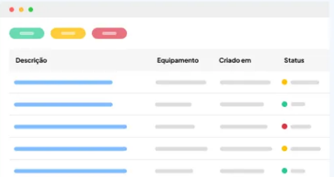

# API de Gerenciamento de Tickets de Suporte Técnico

Esta é uma API simples para gerenciar tickets de suporte técnico, permitindo a criação, atualização, listagem e fechamento de tickets. O projeto foi desenvolvido utilizando Node.js sem dependências de terceiros, com o objetivo de entender os fundamentos do desenvolvimento de APIs. Durante o desenvolvimento, utilizei o **Insomnia** para testar as requisições e validar o funcionamento da API.

## Protótipo do Layout da Aplicação



## Funcionalidades

- **Criação de Tickets**: Crie um novo ticket de suporte técnico.
- **Atualização de Tickets**: Atualize as informações de um ticket existente.
- **Listagem de Tickets**: Liste todos os tickets, com a possibilidade de filtrar por status.
- **Fechamento de Tickets**: Atualize o status de um ticket para "fechado".
- **Exclusão de Tickets**: Remova um ticket do sistema.

## Rotas da API

### Tickets

- **POST /tickets**: Cria um novo ticket.

  - **Body**:
    ```json
    {
      "equipment": "Notebook",
      "description": "Problema com a tela",
      "user": "João Silva"
    }
    ```
  - **Resposta**:
    ```json
    {
      "id": "d4abad45-2399-48be-84a2-223df45e0467",
      "equipment": "Notebook",
      "description": "Problema com a tela",
      "user": "João Silva",
      "status": "open",
      "createdAt": "2023-10-01T12:00:00Z",
      "updatedAt": "2023-10-01T12:00:00Z"
    }
    ```

- **GET /tickets**: Lista todos os tickets.

  - **Query Params**:
    - `status`: Filtra tickets por status (ex: `?status=closed`).
  - **Resposta**:
    ```json
    [
      {
        "id": "d4abad45-2399-48be-84a2-223df45e0467",
        "equipment": "Notebook",
        "description": "Problema com a tela",
        "user": "João Silva",
        "status": "open",
        "createdAt": "2023-10-01T12:00:00Z",
        "updatedAt": "2023-10-01T12:00:00Z"
      }
    ]
    ```

- **PUT /tickets/:id**: Atualiza um ticket existente.

  - **Body**:
    ```json
    {
      "equipment": "Notebook",
      "description": "Problema com a tela resolvido",
      "user": "João Silva"
    }
    ```
  - **Resposta**:
    ```json
    {
      "id": "d4abad45-2399-48be-84a2-223df45e0467",
      "equipment": "Notebook",
      "description": "Problema com a tela resolvido",
      "user": "João Silva",
      "status": "open",
      "createdAt": "2023-10-01T12:00:00Z",
      "updatedAt": "2023-10-01T12:30:00Z"
    }
    ```

- **PATCH /tickets/:id/close**: Fecha um ticket.

  - **Body**:
    ```json
    {
      "solution": "Tela substituída"
    }
    ```
  - **Resposta**:
    ```json
    {
      "id": "d4abad45-2399-48be-84a2-223df45e0467",
      "equipment": "Notebook",
      "description": "Problema com a tela resolvido",
      "user": "João Silva",
      "status": "closed",
      "solution": "Tela substituída",
      "createdAt": "2023-10-01T12:00:00Z",
      "updatedAt": "2023-10-01T12:45:00Z"
    }
    ```

- **DELETE /tickets/:id**: Remove um ticket.
  - **Resposta**: `204 No Content`

## Licença MIT

Copyright (c) [2025] [Vinícius Gomes]

Permissão para usar, copiar, modificar e distribuir este software sem restrições,
desde que o aviso de direitos autorais e este texto sejam incluídos em todas as cópias.

O software é fornecido "como está", sem garantias. Os autores não são responsáveis por
quaisquer danos decorrentes do uso.
